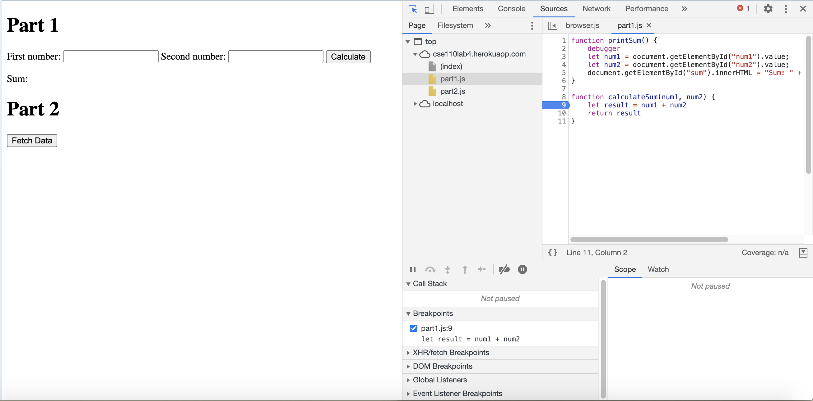
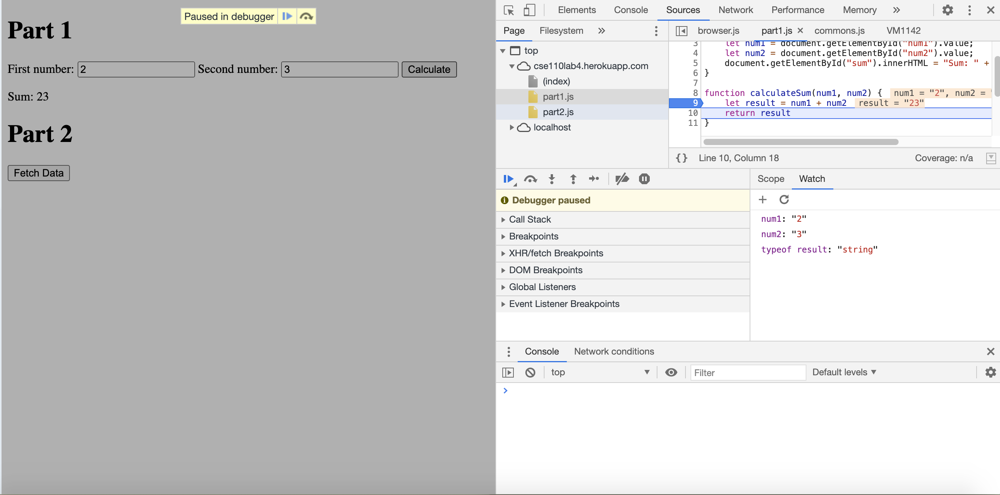
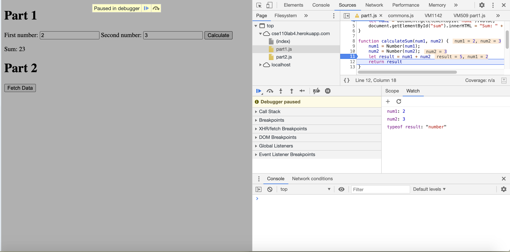

The bug was that the input type of num1 and num2 is string. So the + in the function is actually doing a string concatenation of num1 and num2. Thus, the type of result is a string with num1 following with num2. <br>
I would fix it with changing the type of num1 and num2 before calculating their sum.<br>

```javascript
function calculateSum(num1, num2) {
    num1 = Number(num1);
    num2 = Number(num2);
    let result = num1 + num2
    return result
}
```



1. The name of the new json file is citylots.json.
2. part.js initiated the download of th new file.
3. File size if 11.7MB.
4. It took 45.38s to download.
5. Mozilla/5.0 (Macintosh; Intel Mac OS X 10_15_7) AppleWebKit/537.36 (KHTML, like Gecko) Chrome/87.0.4280.88 Safari/537.36 OPR/73.0.3856.329
6. Apache
7. Tue, 26 Jan 2021 22:14:13 GMT
8. application/json
9. fetchData

